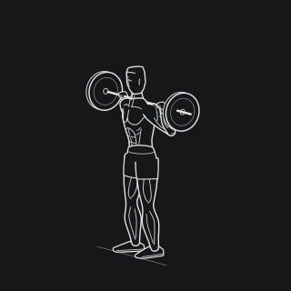
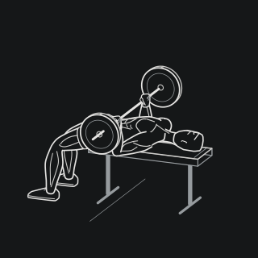
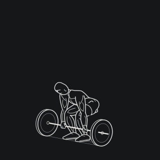
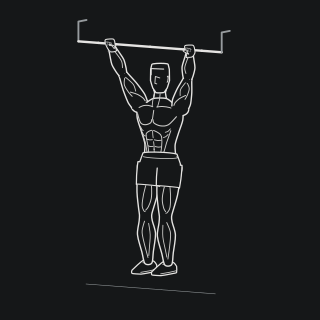

# workout-motion

用于训练记录、健身应用和网站的 SVG 运动动画库。

**[在线演示](https://jichunhou.me/workout-motion/)** · [English](README.md) · **简体中文**

- **29 个连续动画**，共用一致的视觉风格，持续扩充中。
- **零运行时依赖**，JavaScript API 不绑定框架。
- **动态与静态输出**：暂停、定位、调速，或将任意姿态渲染为 SVG。

| 深蹲 | 卧推 | 硬拉 | 引体向上 |
| :---: | :---: | :---: | :---: |
| [](https://jichunhou.me/workout-motion/?lang=zh&motion=squat) | [](https://jichunhou.me/workout-motion/?lang=zh&motion=bench-press) | [](https://jichunhou.me/workout-motion/?lang=zh&motion=conventional-deadlift) | [](https://jichunhou.me/workout-motion/?lang=zh&motion=pull-up) |

以上为 2 倍速的完整动作循环动画，点击预览可进入交互演示。

## 快速开始

使用 Node.js 20+ 和 pnpm 10.28.2 从源码构建 SVG 资源：

```sh
git clone https://github.com/februarysea/workout-motion.git
cd workout-motion
pnpm install --frozen-lockfile
pnpm build
```

构建后会生成：

- `assets/<id>.svg`：29 个动作各自的 SVG 文件，可直接作为图片使用。
- `assets/manifest.json`：动作 ID、名称、时长与 SVG 文件名。
- `dist/`：用于渲染和播放的 JavaScript 模块及 TypeScript 类型声明。

导出的 SVG 是动作进度 `0.2` 处的静态帧；连续动画通过 JavaScript 播放器实现。

## 生成指定姿态的 SVG

构建完成后，可以在 Node.js 中调用 `renderSvg`，生成动作任意进度的 SVG。
将下面的示例保存为仓库根目录下的 `export-frame.mjs`，执行 `node export-frame.mjs`：

```js
import { writeFile } from 'node:fs/promises';
import { renderSvg } from './dist/h2.js';

const svg = renderSvg('squat', { phase: 0.5, size: 256, title: '深蹲' });
await writeFile('squat.svg', svg, 'utf8');
```

这会生成 `squat.svg`。`phase` 表示动作进度，范围为 `0` 到 `1`；
`size` 指定 SVG 的像素尺寸。

## API

29 个动作的接口位于 **`/h2` 入口**，构建后对应 `dist/h2.js`：

| 导出 | 用途 |
| --- | --- |
| `exerciseIds` | 包含 29 个动作 ID 的只读列表 |
| `getExercise(id)` | 返回冻结的名称、时长、副标题与可选关键帧元数据；未知 ID 返回 `undefined` |
| `createPlayer(element, id, options?)` | 挂载 SVG 动画并返回控制接口 |
| `renderSvg(id, options?)` | 返回静态 SVG 字符串，可在 Node 和 SSR 中使用，无需 DOM |

需要在应用中播放动画时，将已挂载的 HTML 元素作为 `host` 传入：

```js
import { createPlayer } from './dist/h2.js';

const player = createPlayer(host, 'bench-press', { autoplay: false });
```

播放器提供 `play()`、`pause()`、`seek(phase)`、`setSpeed(speed)`、`destroy()`，
以及只读的 `playing` / `progress`。倍速为正数。
选项包括 `autoplay`、`phase`、`speed`、`title` 和 `onStateChange`。
可将播放控件绑定到这些方法，并保留可见的暂停按钮。
播放器尊重系统减少动态偏好，在页面隐藏或容器离屏时暂停；移除容器时调用 `destroy()`。

## SVG 样式

内联 SVG 和播放器继承四个 CSS 变量。例如，为带有 `workout-motion` 类名的容器设置浅色主题：

```css
.workout-motion {
  width: 320px;
  max-width: 100%;
  aspect-ratio: 1;
  background: var(--figure-paper);
  --figure-paper: #f4f1e9;
  --figure-ink: #252720;
  --figure-detail: #55594d;
  --figure-muted: #83877a;
}
```

`--figure-paper` 用于遮住后方轮廓，应与容器背景保持一致；缩放时保留 SVG 的宽高比例。
通过 `` 使用外部 SVG 时，请设置 `background: #151718` 以匹配默认底色；它不会继承页面 CSS 变量。

## 动作目录

将以下 ID 传给 `createPlayer`、`renderSvg` 或 `getExercise`。

<details>
<summary>全部 29 个动作 ID</summary>

| ID | 动作 |
| --- | --- |
| `conventional-deadlift` | 传统硬拉 |
| `sumo-deadlift` | 相扑硬拉 |
| `low-bar-squat` | 低杠深蹲 |
| `reverse-lunge` | 后撤弓步蹲 |
| `glute-bridge` | 臀桥 |
| `hip-thrust` | 杠铃臀推 |
| `single-arm-dumbbell-row` | 单臂哑铃划船 |
| `incline-dumbbell-press` | 上斜哑铃卧推 |
| `dumbbell-shoulder-press` | 站姿哑铃推举 |
| `hammer-curl` | 锤式弯举 |
| `lateral-raise` | 哑铃侧平举 |
| `seated-cable-row` | 坐姿绳索划船 |
| `lat-pulldown` | 高位下拉 |
| `triceps-pushdown` | 绳索三头下压 |
| `dip` | 双杠臂屈伸 |
| `bent-over-row` | 俯身杠铃划船 |
| `barbell-curl` | 杠铃弯举 |
| `front-squat` | 杠铃前蹲 |
| `bench-press` | 卧推 |
| `squat` | 杠铃后蹲 |
| `overhead-press` | 杠铃推举 |
| `romanian-deadlift` | 罗马尼亚硬拉 |
| `pull-up` | 引体向上 |
| `landmine-press` | 单手地雷杆换步推举 |
| `hang-clean` | 悬垂翻 |
| `power-clean` | 高翻 |
| `box-jump` | 双脚跳箱 |
| `depth-box-jump` | 落下反弹跳箱 |
| `lateral-box-jump` | 侧向跳箱 |

</details>

## 许可

[PolyForm Noncommercial 1.0.0](LICENSE) 允许的非商业使用免费，超出其允许用途的商业使用须取得[书面许可](COMMERCIAL-LICENSE.md)。
请保留来源和 [NOTICE](NOTICE)，具体以[完整条款](LICENSE)为准。
